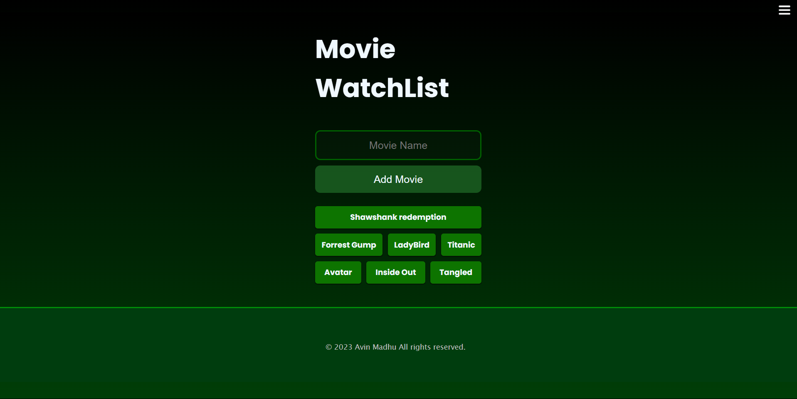

# Movie Lister 
Welcome to the main repository for Movie Lister !

Visit the site: [Link](https://movie-watch-list-avin-madhu.vercel.app/)

This project aims to create a convinient way for a user to store their movie list in a simple manner.

 

### Features:
* <strong>Storing Textual Content: </strong> Can store Textual data in a clean way.
* <strong>Simple UI: </strong> The website incorporates neat color schemes and neat UI for better user experience
* <strong>Firebase Backend:</strong> Utilizing Firebase as the backend ensures reliable data storage and efficient performance.

### Technologies Used:
* HTML5: Used for structuring the web pages.
* CSS3: Employed for styling and layout customization.
* Vanilla JavaScript: Implemented for dynamic interactivity and functionality.
* Firebase: Backend infrastructure for data storage, authentication, and real-time updates.

### contribution
Feel free to contribute to the project by adding new features, fixing bugs, or improving documentation. We welcome any suggestions or feedback to make this project even more accessible and user-friendly.
